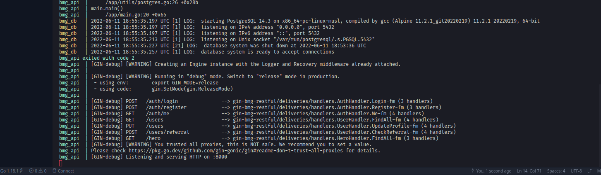
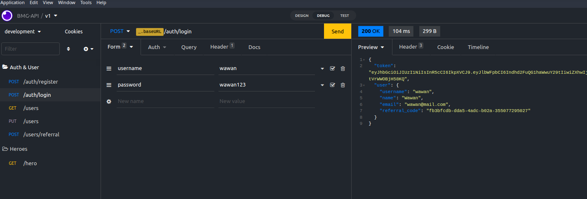
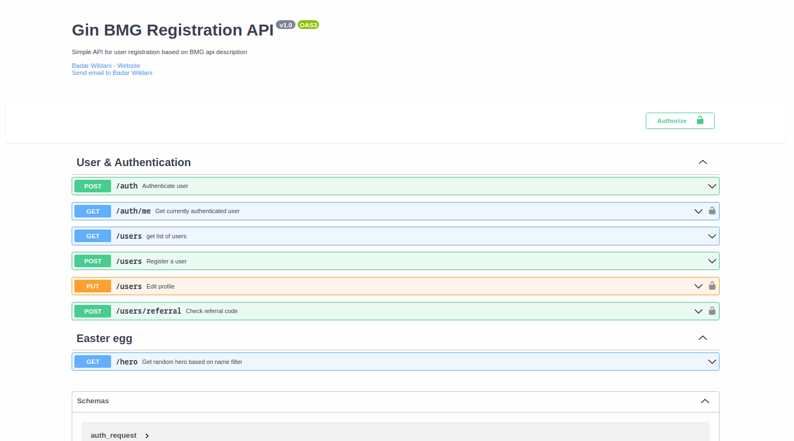

## BMG API Test

[](https://www.codacy.com/gh/wildanie12/bmg-api/dashboard?utm_source=github.com&utm_medium=referral&utm_content=wildanie12/bmg-api&utm_campaign=Badge_Grade)
[](https://www.codacy.com/gh/wildanie12/bmg-api/dashboard?utm_source=github.com&utm_medium=referral&utm_content=wildanie12/bmg-api&utm_campaign=Badge_Coverage)

Simple API created using gin golang framework based on BMG Description.

### Getting Started

You have to copy the provided `.env.example` to `.env` and configure the provided configuration if necessary

```
cp .env.example .env
```

> _Important: database host must be the same with database container name defined in `docker-compose.yaml`_

To run this app locally, you can clone this particular repository and make sure you have golang and postgresql environment setup.
A docker environment is also written in `docker-compose.yaml` so you can recreate the environment easily.

run the command below

```
docker compose up
```

This will create two containers, one of them is the app itself while the others is postgresql instance. Those containers were already connected through docker network

<p align="center">
    
</p>

### API Endpoints

an API specification is also defined in `apispec.yaml`. The sample http client request can also be found in `/http-clent-export`. Those sample export file can be imported in both postman or insomnia. Here are the example when it is imported on insomnia.

> Swagger API Specification: [app.swaggerhub.com](https://app.swaggerhub.com/apis-docs/wildanie12/gin-bmg_registration_api/v1.0)

<p align="center">
    
</p>
<p align="center">
    
</p>
